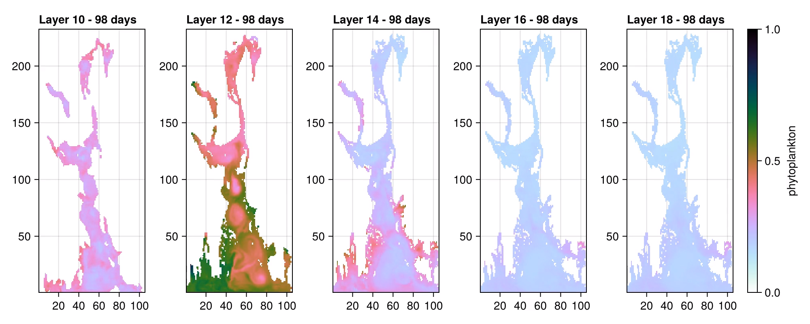

# FjordSim.jl

A framework for regional ocean simulations built on top of
[Oceananigans](https://github.com/CliMA/Oceananigans.jl) and
[NumericalEarth](https://github.com/NumericalEarth/NumericalEarth.jl).

## The idea

Regional ocean models are usually set up one of two ways: through config files — text or YAML, the
way [ROMS](https://www.myroms.org/) does it — or through a programmable script, the way Oceananigans
and NumericalEarth themselves work. A config file puts every choice a run makes in one place, but
only the choices its authors anticipated; adding genuinely new behavior means leaving the config
format and writing code. A script can do anything, but the setup is now spread across however much of
the script builds it, and nothing stops two runs of "the same model" from silently diverging.

FjordSim does both at once. A setup is a `FjordConfig` — a single Julia value you can read top to
bottom — but its fields are not limited to numbers and strings. A field can hold a live, programmable
object: a turbulence closure, an advection scheme, a whole dataset adapter with its own download and
regrid logic. Changing the *logic* of a run — swapping in a different closure, adding a new atmosphere
source — means writing a new object and putting it in the config, not writing a parallel script. And
because it is still a config, the complete list of what a run does is still one file rather than
something scattered across a codebase.

What makes that cheap is Julia's multiple dispatch. Each pipeline in FjordSim is one generic function
plus a handful of *hooks* — dispatch points that take the config as an argument. So adding a source is
two additive steps and no edits. Define a struct subtyping the matching abstract config type:

```julia
Base.@kwdef mutable struct MyForcingConfig{R} <: AbstractForcingConfig
    ...
end
```

then add methods for that struct to the hook functions the pipeline already calls
(`forcing_time_steps`, `forcing_source_grid`, `forcing_variable_names`). Julia selects your methods
whenever your config is the argument, so `prepare_forcing`, the diagnostic plots, the path helpers and
the command line all work on the new source without knowing it exists. Nothing in `FjordConfig` or in
any generic pipeline is touched. See [Extending FjordSim](#extending-fjordsim) below, and
[`docs/dispatch.md`](docs/dispatch.md) for the complete method inventory.

This is a direction more than a finished state. Today the programmable fields are the grid,
bathymetry, forcing, river, atmosphere and simulation configs; more of the pipeline is meant to become
config-visible this way over time, and configs are expected to nest more deeply as they do — a forcing
config already holds a river config.

## Installation

FjordSim is in the General registry, so the shortest route is:

```julia
pkg> add FjordSim
```

The registered version is 0.0.1 and lags the repository, though, so for current work — and for
anything that involves editing a setup — clone it instead:

```bash
git clone https://github.com/NIVANorge/FjordSim.jl.git
cd FjordSim.jl
julia --project -e 'using Pkg; Pkg.instantiate()'
```

`instantiate` resolves a `Manifest.toml` from `Project.toml`, then installs and precompiles the
dependencies. To track the repository from a project of your own rather than working inside it,
`add https://github.com/NIVANorge/FjordSim.jl.git`.

Julia **1.12 or newer** is required: the `-m FjordSim` command form used throughout this README is
Julia 1.12's package entry point.

A GPU is not strictly required — `architecture = :auto` falls back to the CPU — but running a
simulation without one is impractically slow. Preparing the input data is fine on a laptop.

## Quick start: Drammensfjorden

`drammensfjorden()` in `src/Setups/drammensfjorden.jl` is the smallest complete setup — the same
physics as the built-in Oslofjord one on a smaller domain, over a 30-day window instead of a full
year — so it is the fast way to exercise every pipeline step once:

```julia
function drammensfjorden()
    data_root = joinpath(homedir(), "FjordSim_data", "drammensfjorden")
    FT = Oceananigans.defaults.FloatType

    return FjordConfig(
        grid_config       = EvenGrid(size = (150, 200, 11), longitude = (10.20, 10.45), ...),
        bathymetry_config = DybdedataConfig(data_root = data_root, output_file = "bathymetry.nc", ...),
        forcing_config    = NorKystConfig(
            data_root = data_root,
            years     = [2020],
            rivers    = OF800RiversConfig(data_root = data_root),
            ...
        ),
        atmosphere_config = NORA3Config(data_root = data_root, years = [2020], ...),
        simulation_config = SimulationConfig(
            buoyancy           = SeawaterBuoyancy(FT, equation_of_state = TEOS10EquationOfState(FT)),
            closure            = (CATKEVerticalDiffusivity(minimum_tke = 7e-6), ...),
            initial_conditions = FromForcing(),   # the prepared forcing's own state at start_date
            start_date         = DateTime(2020, 1, 1),
            stop_time          = 30days,          # a short window, not a full year
            ...
        ),
    )
end
```

Preparing the data and running it is seven commands, in this order:

```bash
julia --project -m FjordSim prepare_bathymetry  --config drammensfjorden
julia --project -m FjordSim download_forcing    --config drammensfjorden
julia --project -m FjordSim prepare_forcing     --config drammensfjorden
julia --project -m FjordSim add_rivers          --config drammensfjorden
julia --project -m FjordSim download_atmosphere --config drammensfjorden
julia --project -m FjordSim prepare_atmosphere  --config drammensfjorden
julia --project -m FjordSim run_simulation      --config drammensfjorden
```

Each subcommand is named after the function it calls, so the same steps run from the REPL:

```julia
using FjordSim
config = drammensfjorden()
prepare_bathymetry(config)
download_forcing(config)
prepare_forcing(config)
add_rivers(config)
download_atmosphere(config)
prepare_atmosphere(config)
run_simulation(config)
```

Snapshots land in `~/FjordSim_results/drammensfjorden/`. To inspect or step through the assembled
model instead of running it outright, use `build_simulation` in place of `run_simulation`:

```julia
using FjordSim
simulation = build_simulation(drammensfjorden())
run!(simulation)
```

Only one of the 25 river outlets in the OF800 dataset — Drammenselva, the fjord's dominant freshwater
source — is inside this grid; the rest belong to the Oslofjord and are reported as skipped. That is
expected, not a failure.

The two reference sections below, [Preparing the input data](#preparing-the-input-data) and
[Running a simulation](#running-a-simulation), cover each step in full, including the features this
setup does not use — looping and checkpointing.

## What a run is made of

A simulation is assembled from three data components, each regridded onto — or around — the same
simulation grid:

1. **Bathymetry** — the domain's depth and land/sea mask. `prepare_bathymetry` regrids a bathymetry
   source onto the simulation grid (built from the grid config's bounds and resolution) and writes the
   result as a NetCDF file. That file is what actually defines the model's `ImmersedBoundaryGrid`. The
   built-in source is the public [Geonorge](https://www.geonorge.no/) Sjøkart Dybdedata dataset.

2. **Forcing** — boundary and initial conditions from a larger-scale ocean model. `prepare_forcing`
   regrids a regional reanalysis (built in: NorKyst-800m) onto the simulation grid, producing
   relaxation values and lambdas along one open edge. `add_rivers` then writes river relaxation into a
   copy of that file. The same prepared file can seed a run's initial conditions, so the ocean starts
   from a realistic state rather than a uniform water column.

3. **Atmospheric data** — the surface forcing a run needs but a regional ocean model does not carry.
   `prepare_atmosphere` regrids a reanalysis product (built in: MET Norway's
   [NORA3](https://thredds.met.no/thredds/projects/nora3.html)) onto its own regular longitude/latitude
   grid, independent of the ocean grid since NumericalEarth interpolates between them, producing the
   eight variables a `PrescribedAtmosphere`/`PrescribedRadiation` pair needs.

Bathymetry and forcing go onto the *same* grid, which is why `prepare_forcing` needs the processed
bathymetry: that is where its land mask comes from. The atmosphere is independent of both.

A setup can configure any subset. Omitting the rivers, the atmosphere or the simulation config makes
the corresponding steps no-ops rather than errors. The grid, bathymetry and forcing are always
required.

## Preparing the input data

Every step takes the setup to prepare via `--config`, which is required and is the only option —
everything else is stated in the setup itself. The Oslofjord setup is used below because it
configures every step:

```bash
# Bathymetry: downloads the Geonorge Sjøkart FileGDB on first use (~2.3 GB), regrids it onto the
# configured grid, and writes the bathymetry NetCDF plus a diagnostic plot
julia --project -m FjordSim prepare_bathymetry --config oslofjorden

# Forcing: downloads and subsets the configured dataset (NorKyst-800m) over the setup's region
# and years, then regrids the download onto the simulation grid
julia --project -m FjordSim download_forcing --config oslofjorden
julia --project -m FjordSim prepare_forcing --config oslofjorden

# Rivers: writes river relaxation into a copy of the prepared forcing, leaving the original alone.
# Re-runnable without redoing prepare_forcing.
julia --project -m FjordSim add_rivers --config oslofjorden

# Atmosphere: downloads and subsets NORA3, then regrids it onto a regular lon/lat grid.
# The download is by far the slowest step — a year is close to 10000 OPeNDAP reads — and skips any
# month already on disk, so an interrupted run resumes.
julia --project -m FjordSim download_atmosphere --config oslofjorden
julia --project -m FjordSim prepare_atmosphere --config oslofjorden

# Every subcommand, with the setups it accepts
julia --project -m FjordSim --help
```

The same steps run from the REPL, which is also how to debug one:

```julia
using FjordSim
config = oslofjorden()
prepare_bathymetry(config)
download_forcing(config)
prepare_forcing(config)

using Debugger        # step into a step
@enter prepare_forcing(config)
```

A step the setup does not configure — `add_rivers` on a setup with no rivers, the atmosphere steps on
a setup with no atmosphere — does nothing rather than failing.

The forcing config's `architecture` field decides where the regridding interpolation runs. `:auto`
(the default) uses the GPU when one is usable and the CPU otherwise, so the same config works on a
compute node and on a laptop; `:cpu` and `:gpu` pin it, and `:gpu` errors rather than silently falling
back to a roughly 12x slower CPU run.

### Changing `start_date` or `stop_time`

Both prepare steps pad their time axes to span the window the simulation config names, so moving
either end invalidates the prepared files. Re-run, in this order:

```bash
julia --project -m FjordSim prepare_forcing     --config oslofjorden
julia --project -m FjordSim add_rivers          --config oslofjorden
julia --project -m FjordSim prepare_atmosphere  --config oslofjorden
```

`add_rivers` is not optional here: it copies the forcing file and patches the copy, so the copy — which
is what the simulation reads — still carries the *old* time axis until the step is re-run. Neither
download step is affected; both prepares are pure regrids.

## Running a simulation

Once every step the setup configures has run, `run_simulation` builds the coupled model from the
setup's own prepared files and runs it:

```bash
julia --project -m FjordSim run_simulation --config oslofjorden
```

or, equivalently, `julia --project examples/oslofjord.jl`. Snapshots go to the simulation config's
`results_root` — `$HOME/FjordSim_results/oslofjorden/` for the built-in Oslofjord setup — separate from
the input data root.

Everything the run needs comes from the setup: the grid from the processed bathymetry, the forcing
from the rivers-augmented file when the setup names rivers and the plain prepared file otherwise, and
the atmosphere from the file `prepare_atmosphere` wrote. A missing prerequisite is reported as the
command that produces it. The simulation config's `architecture` field selects the device, with the
same `:auto`/`:cpu`/`:gpu` meanings as the forcing config's.

To inspect or step through the assembly instead of running it, build the simulation without starting
it:

```julia
using FjordSim
simulation = build_simulation(oslofjorden())
run!(simulation)
```

### What the simulation is made of

The buoyancy, closure, advection schemes, tracers, initial conditions, coriolis, sea ice, run length,
output interval and time-step wizard settings are all the `SimulationConfig` in
`src/Setups/oslofjorden.jl`. `SimulationConfig` has **no defaults at all**, so that one block is the
whole story: every knob is stated there, and omitting one is an `UndefKeywordError` naming it rather
than a silently inherited value.

`initial_conditions` takes one of three shapes:

- a literal `NamedTuple` of constants, functions or fields, e.g. `(T = 5.0, S = 33.0)`;
- `FromForcing()` — the prepared forcing's own state at `start_date`, which is what
  `drammensfjorden()` uses;
- `FromResults(path)` — a previous run's snapshot, its last record unless you name a date.

The latter two are a *lossy warm start*: the turbulence state, the free surface and the
Adams-Bashforth tendencies are not carried over, so the first hours are an adjustment. `pickup` is the
exact restart — the two are complementary rather than alternatives.

A run can also repeat its window several times with the ocean state carried over (`loops`, a spin-up
for basins that do not equilibrate within one forcing year), and can write periodic checkpoints
(`checkpoint_interval`) that a later run resumes from with `pickup = true`. Both built-in setups set
`loops = 1`; `oslofjorden()` shows checkpointing turned on. Both fields are documented on
`SimulationConfig` in `src/Simulations.jl`.

### The run log

`run_simulation` writes a full transcript to `fjordsim_<launch time>.log` in the setup's results
directory while still printing live to the terminal. The other steps print to the terminal only.

If a run fails, that log is where to read the error: a stacktrace through the coupled model scrolls
the error message itself out of the terminal long before the trace ends. Type parameters in the trace
are abbreviated to `{…}`, as they are in the REPL, so each frame stays one readable line.

```bash
julia --project -m FjordSim run_simulation --config oslofjorden
# the path is printed as the run starts; the error is at the top of it
head -60 ~/FjordSim_results/oslofjorden/fjordsim_20260803T141530.log
```

The log lands beside the output it describes and carries the same launch-time tag as the snapshots, so
runs never overwrite each other's transcripts.

## Setups

Each fjord is a zero-argument function in `src/Setups/` (`oslofjorden.jl`, `drammensfjorden.jl`)
returning a `FjordConfig`, which groups a grid, a bathymetry, a forcing and — optionally — an
atmosphere and a simulation configuration. `setup_names()` lists the registered setups and
`fjord_config(name)` returns one by name; that is what `--config` resolves.

By default, input data goes to `$HOME/FjordSim_data/<fjord>/` and results to
`$HOME/FjordSim_results/<fjord>/`. The config fields naming individual files are relative to the
setup's `data_root`, so setting one to an absolute path relocates just that file — which is how a
single copy of the 2.3 GB Geonorge database is shared between fjords.

To add a fjord to the package, copy an existing setup file into `src/Setups/`, adjust it, and add it to
the `SETUPS` registry in `src/Setups/Setups.jl`. That registry is keyed by the runtime string
`--config` receives, which is why it is a two-place edit.

### A fjord outside the package

A fjord does not have to live in FjordSim. Put the `FjordConfig` in a standalone `.jl` file whose last
expression is the config, and pass its path to `--config`:

```julia
# ~/fjords/hardangerfjorden.jl
using FjordSim

data_root = joinpath(homedir(), "FjordSim_data", "hardangerfjorden")

FjordConfig(
    grid_config = EvenGrid(
        size      = (200, 300, 12),
        halo      = (7, 7, 7),
        longitude = (5.3, 6.5),
        latitude  = (59.9, 60.5),
        # Nz + 1 faces, bottom to top, ending at 0.0.
        z_faces   = [
            -800.0, -600.0, -400.0, -250.0, -150.0, -100.0,
            -50.0, -25.0, -15.0, -10.0, -5.0, -2.0, 0.0,
        ],
    ),
    bathymetry_config = DybdedataConfig(
        data_root   = data_root,
        output_file = "bathymetry.nc",
        plot_file   = "bathymetry.png",
        # Reuse the 2.3 GB Geonorge FileGDB already downloaded for another fjord instead of
        # fetching a second copy.
        geodatabase_file = joinpath(
            homedir(), "FjordSim_data", "oslofjorden",
            "Basisdata_0000_Norge_25833_Dybdedata_FGDB.gdb",
        ),
    ),
    forcing_config = NorKystConfig(
        data_root            = data_root,
        output_directory     = "norkyst",
        output_file          = "forcing.nc",
        plot_file            = "forcing.png",
        relaxation_edge      = :west,
        relaxation_cells     = 10,
        relaxation_timescale = 86400.0,
        architecture         = :auto,
        parameters           = ["temperature", "salinity", "u_eastward", "v_northward"],
        years                = [2020],
    ),
)
```

```bash
julia --project -m FjordSim prepare_bathymetry --config ~/fjords/hardangerfjorden.jl
```

or, equivalently, from the REPL:

```julia
using FjordSim
config = fjord_config(expanduser("~/fjords/hardangerfjorden.jl"))
prepare_bathymetry(config)
```

Three things to know:

- **The `.jl` suffix decides how `--config` reads its argument.** Anything ending in `.jl` is loaded as
  a file; anything else is looked up in the registry, so a misspelled setup name reports the available
  setups rather than a missing file.
- **The file's last expression must be the `FjordConfig`** — no `return`, no trailing assignment. A file
  evaluating to anything else is rejected up front instead of failing inside a pipeline later.
- **The file is evaluated in `Main`**, so it needs its own `using FjordSim`. `~` and relative paths are
  expanded.

Registering a fjord only buys the shorter `--config <name>`, its appearance in `--help`, and coverage
by the tests that loop over `setup_names()`. For a one-off fjord, the standalone file is the better
choice.

## Extending FjordSim

To add a new kind of grid, bathymetry source, forcing dataset, river dataset or atmosphere dataset,
define a struct subtyping the matching supertype and add methods for it to that supertype's hooks.
`FjordConfig`, the generic pipelines and the command line stay unchanged.

| Config | Generic entry point | Hooks a new source implements | Template |
|---|---|---|---|
| Grid (`AbstractGridConfig`) | — | `LatitudeLongitudeGrid(architecture, config)` | `src/Grids.jl` |
| Bathymetry (`AbstractBathymetryConfig`) | `prepare_bathymetry(target_grid, config)` | `bathymetry_dataset(target_grid, config)`; optionally `regrid_options`, `smoothing_options` | `src/Bathymetry/geonorge.jl` |
| Forcing (`AbstractForcingConfig`) | `prepare_forcing(target_grid, config)`, `download_forcing(config)` | `forcing_time_steps`, `forcing_source_grid`, `forcing_variable_names`; `download_forcing(target_grid, config)` if it downloads | `src/Forcing/norkyst.jl` |
| Rivers (`AbstractRiverConfig`) | `add_rivers(target_grid, config)` | `river_locations`, `river_series`, `download_rivers` | `src/Forcing/of800_rivers.jl` |
| Atmosphere (`AbstractAtmosphereConfig`) | `prepare_atmosphere(target_grid, config)`, `download_atmosphere(config)` | `atmosphere_time_steps`, `atmosphere_source_grid`, `atmosphere_variable_names`; `download_atmosphere(target_grid, config)` if it downloads; `prescribed_atmosphere`, `prescribed_radiation` if the setup is simulated | `src/Atmospheres/nora3_source.jl` |
| Simulation (`AbstractSimulationConfig`) | `build_simulation(config)`, `run_simulation(config)` | none — fields only | `src/Setups/oslofjorden.jl` |

A river config is not a `FjordConfig` field of its own — it goes in the forcing config's `rivers`
field, `nothing` for a setup with no rivers.

Path resolution (`bathymetry_path`, `forcing_path`, `forcing_directory`, `river_forcing_path`,
`atmosphere_path`, `atmosphere_directory`, `results_path`, `plot_path`) and the diagnostic plots
(`plot_bathymetry`, `plot_forcing`, `plot_atmosphere`) are defined on the supertypes, so a new source
inherits them for free — along with the pipelines themselves, and about a dozen other generics.

**[`docs/dispatch.md`](docs/dispatch.md) is the complete inventory**: for each supertype, the required
hooks, the optional hooks with their defaults, and every generic a subtype inherits, each with the
file and line it is defined at. Each supertype's docstring in `src/Configs.jl` states the matching
field contract, and a missing required hook surfaces as a `MethodError` naming it.

## Data and related repositories

The grid, forcing and atmospheric forcing for the Oslofjord are available
[here](https://www.dropbox.com/scl/fo/gc3yc155b5eohi7998wgh/AGN2Yt3HyQ0LlZGImpcca6o?rlkey=x6okc3uxe2avud6sbxgd00l14&st=093llyqp&dl=0)
if you would rather not run the preparation steps yourself.

Further preparation scripts for the Oslofjord live in
[NIVANorge/oslofjord-sim](https://github.com/NIVANorge/oslofjord-sim).


